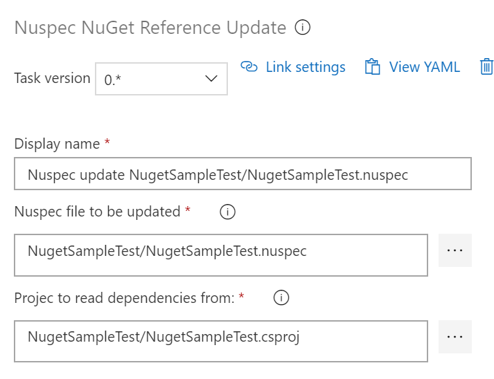

# Nuspec NuGet Dependency Update
This Azure DevOps build task is aimed at updating your Nuspec dependencies to keep them synchronized with the actual dependencies found in your .Net Project.  When building out a set of NuGet packages that are inter-related you may often find that you must remember to update the nuspec to reflect your changes after you've updated the version that your project is refrencing, which is often something "extra" that is cumbersome and is often missed or forgotten, and before you know it your dependency list is out of date. 
This task works for projects where you've migrated your NuGet Package References to your project files and away from a packages file.  It will read your PackageReference items inside your csproj file and either create the depedency tree in your nuspec, or replace any existing dependecy info found there with the items from your project.

## Azure Dev Ops YAML
steps: --

`- task: oneluckidevNuspecRefUpdate@0`

`  displayName: 'Nuspec update NugetSampleTest/NugetSampleTest.nuspec'`

`  inputs:`
`    nuspecFile: NugetSampleTest/NugetSampleTest.nuspec`

`    projectFile: NugetSampleTest/NugetSampleTest.csproj`

## Inputs Images
